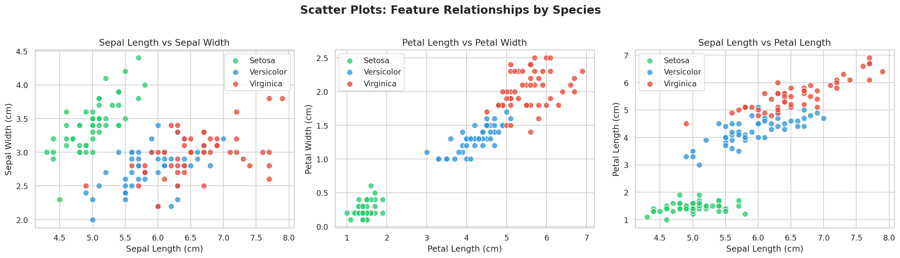
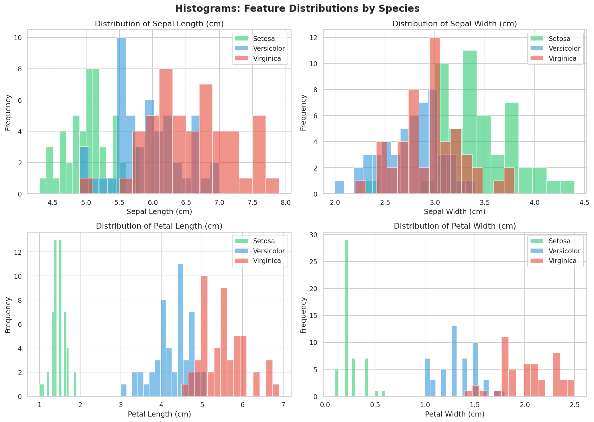
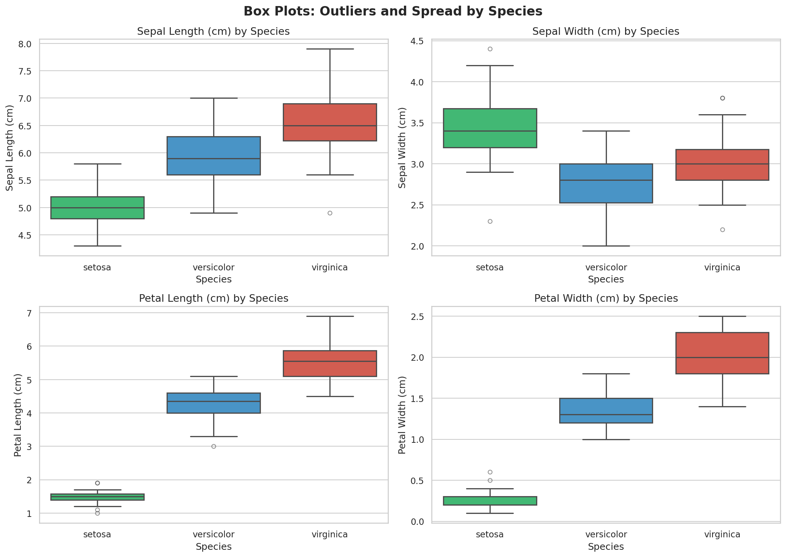
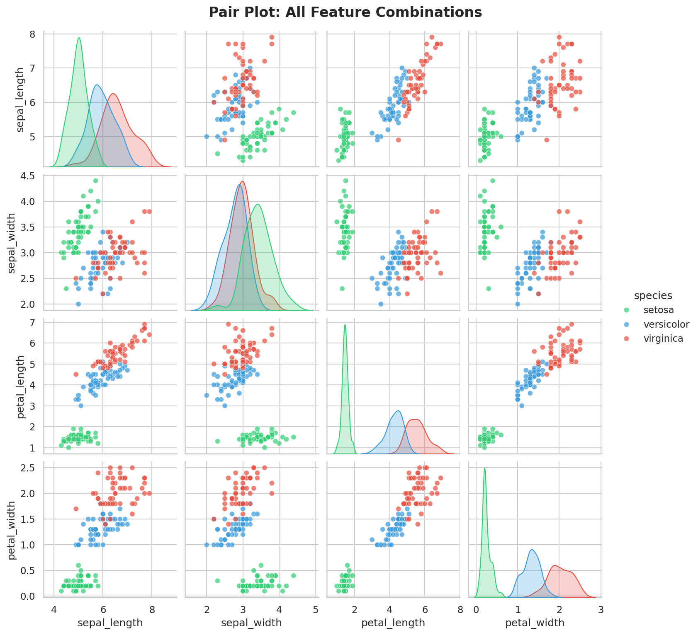
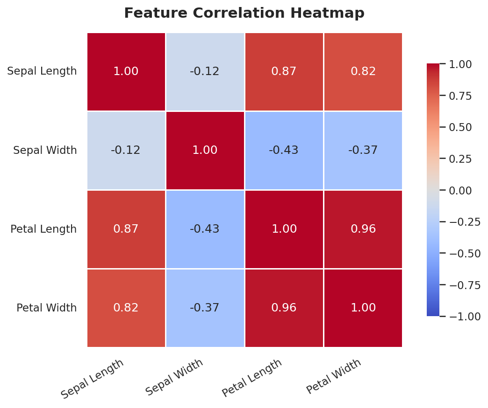

  Task 1: Exploring and Visualizing the Iris Dataset
**DevelopersHub Corporation — Data Science & Analytics Internship**

---

 Task Objective
The goal of this task is to explore and visualize the famous **Iris Dataset** using Python.  
This includes loading the data, inspecting its structure, summarizing statistics, and creating meaningful visualizations to understand patterns across three iris species:
- *Iris Setosa*
- *Iris Versicolor*
- *Iris Virginica*

---

 Approach

### Libraries Used
- **Pandas** — Data loading and inspection
- **NumPy** — Numerical operations
- **Matplotlib** — Basic visualizations
- **Seaborn** — Advanced and styled visualization
-
- Steps Followed
1. Loaded the Iris dataset using `seaborn.load_dataset()`
2. Inspected structure using `.shape`, `.columns`, `.head()`, `.info()`
3. Checked for missing values and class balance
4. Generated statistical summary overall and per species
5. Created 6 visualizations to explore the data deeply

 Visualizations

### 🔵 Scatter Plots — Feature Relationships

> Petal Length vs Petal Width shows the **clearest separation** between all three species.

Histograms — Feature Distributions

> Setosa has very **compact and distinct** petal distributions compared to the other two species.

---

Box Plots — Outliers and Spread

> Minor outliers visible in Setosa's sepal width. **Virginica** consistently has the largest measurements.

---

 🔗 Pair Plot — All Feature Combinations

> A complete overview of every feature pair. Petal features provide the **strongest visual separation**.

---

 🌡️ Correlation Heatmap

> Petal Length and Petal Width are **highly correlated (r = 0.96)**. Sepal Width shows a negative correlation with petal features.

---

 🎻 Violin Plots — Distribution Shape

> Setosa shows a very **narrow, compact** petal distribution — a tight cluster of small values.

---

 📈 Results and Key Insights

| Finding | Detail |
|---|---|
| **Best separating features** | Petal Length and Petal Width |
| **Most distinct species** | Setosa — easily separable from others |
| **Hardest to separate** | Versicolor and Virginica overlap in sepal measurements |
| **Strongest correlation** | Petal Length ↔ Petal Width (r = 0.96) |
| **Outliers** | Minor outliers in Setosa sepal width |
| **Largest species** | Virginica has highest average measurements |

---

 Conclusion
Petal features (Length and Width) are the **most powerful features** for distinguishing iris species.  
A machine learning classification model trained on this dataset would achieve very high accuracy using petal measurements as key features.

---

*Task 1 Complete — DevelopersHub Corporation Data Science & Analytics Internship*
